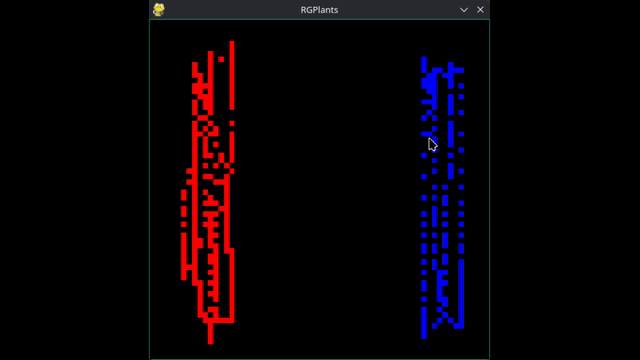

# RGPlants — PROCJAM 2024



An open-ended Artificial Life simulation where color-coded organisms spread, blend, and mutate across a 64×64 grid. There is no fitness function and no convergence goal — only emergent patterns arising from local interactions between neighbors.

Built with Python and Pygame. Submitted to [PROCJAM 2024](https://itch.io/jam/procjam).

---

## What it does

Each cell on the grid is an organism carrying an RGB color as its **gene**. At each simulation step, organisms can:

- **Replicate (Mitosis)** — spread to an adjacent empty cell, passing a blended gene
- **Die** — vacate their position
- **Mutate** — shift one color channel by ±25 during replication

The color of each organism is updated every step by **averaging its gene with all living neighbors** — a local crossover rule that produces smooth gradients, color waves, and unexpected emergent patterns depending on starting conditions and parameter settings.

No individual is trying to optimize anything. The system's behavior is entirely a consequence of stochastic local rules.

---

## Key concepts

| Concept                 | Implementation                                                 |
| -------------------------| ----------------------------------------------------------------|
| **Gene**                | RGB tuple `(R, G, B)`                                          |
| **Crossover**           | Blending crossover — average between parent and displaced cell |
| **Mutation**            | Random channel ±25 with configurable probability               |
| **Selection pressure**  | None — purely generative                                       |
| **Simulation paradigm** | Open-Ended Evolution / Cellular Automata                       |

### How crossover actually works

Crossover is **conditional on collision**. When an organism replicates, it picks a random neighboring cell to expand into. Two outcomes are possible:

- **Target cell is empty** → the offspring inherits the parent's gene directly (no crossover). Mutation may still apply.
- **Target cell is occupied** → the offspring's gene is the **average** of the parent's gene and the gene of the cell being displaced. The displaced cell is replaced. Mutation may still apply on top of the blended result.

High mutation rates preserve color variety; low mutation rates let the grid converge toward uniform tones. The most visually interesting behaviors emerge at the boundary between these two forces.

---

## Controls

| Key            | Action                                       |
| ----------------| ----------------------------------------------|
| **Left click** | Paint organisms with the current brush color |
| **Space**      | Open/close the configuration menu            |
| **P**          | Pause/unpause                                |
| **R**          | Reset (meteor — clears the screen)           |
| **ESC**        | Quit                                         |

---

## Configuration menu (Space)

| Parameter | Description |
|---|---|
| **Brush Color (R/G/B)** | Color gene of organisms you paint |
| **Replication (%)** | Probability of mitosis per step |
| **Death (%)** | Probability of organism dying per step |
| **Mutation (%)** | Probability of mutation during replication |

Parameters apply to **newly painted** organisms. Organisms already on screen keep their original parameters.

---

## Running locally

In Linux: Download and execute 'Exe File/main'

**Requirements:** Python 3.10+, Pygame

```bash
git clone https://github.com/non4to/PROCJAM-2024.git
cd PROCJAM-2024
pip install -r requirements.txt
python3 main.py
```

The simulation loads `img.jpg` as the initial color state. You can replace this file with any image — its pixels will be used as the starting gene distribution across the grid.

---

## Notes

This project was built collaboratively with [@ma-ath](https://github.com/ma-ath), whose made it possible to start with an image and also gave tips on repo organization. 
---

*Made for PROCJAM 2024 — the procedural generation jam.*